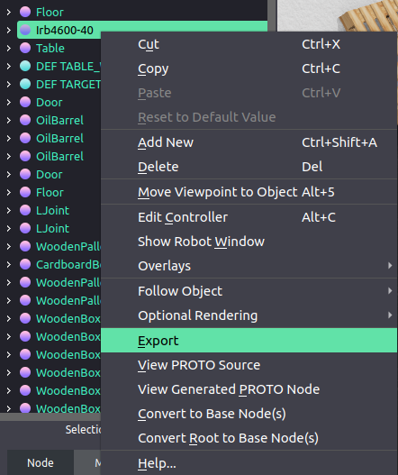

# Python Bindings for `ikfast`

Generate a Python `ikfast` library from the given URDF file.
This project provides all necessary utilities to generate `ikpy` C++ files and Python bindings for it.

## Getting Started

Export URDF from Webots:  

```
(right click on the robot in scene tree) > Export > (name it `robot.urdf`) > Save
```

Move to the directory with `robot.urdf` and execute:
```bash
docker run -v ${PWD}:/output pyikfast [base_link] [effector]
```

Your Python library is ready!
Install it as:
```bash
pip3 install .
```

Use the library
```python
import pyikfast


target_translation = [0.5, 0.5, 0.5]
target_rotation = [1, 0, 0, 0, 1, 0, 0, 0, 1]
positions = pyikfast.inverse(target_translation, target_rotation)
print(positions)
```

## Development
If you are interested into the library development here are a few notes:

```bash
# Building using Docker
docker build . --tag pyikfast
docker run -it -v ${PWD}/output:/output --entrypoint bash pyikfast
/entrypoint.bash base_link solid_12208 _ext

# Compile standalone
g++ $(find -name '*.cpp') -o ikfast
ikfast 1 0 0 0.5 0 1 0 0.5 0 0 1 0.5

# Python
python3 -c "import pyikfast; print(pyikfast.inverse([0.5, 0.5, 0.5], [1, 0, 0, 0, 1, 0, 0, 0, 1]))"
python3 -c "import pyikfast; print(pyikfast.forward([0.927295218001612, -2.899331265288886, 2.048719302774242, -1.057447868999410, 1.163951188044116, 0.612010251709654]))"
```